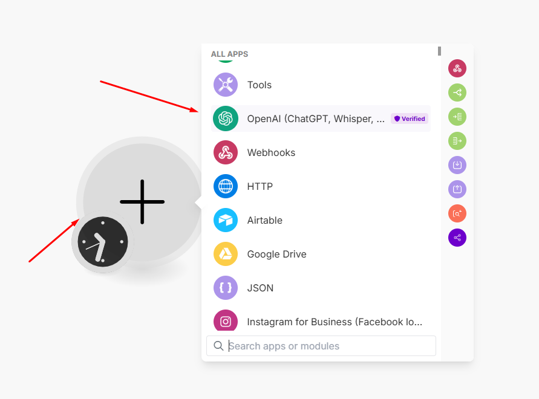
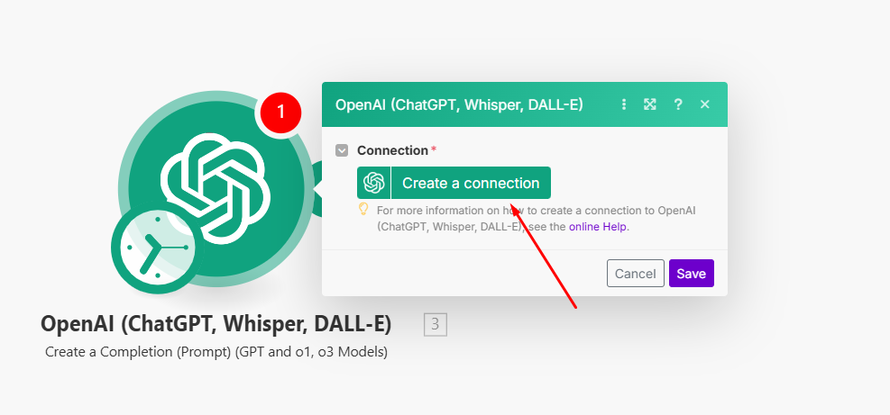
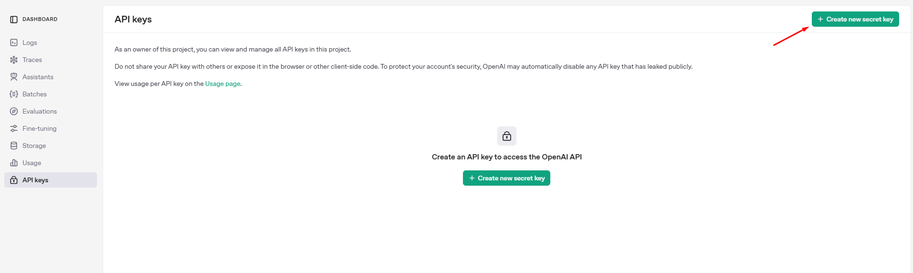
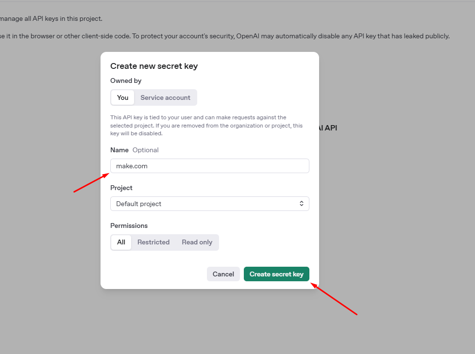
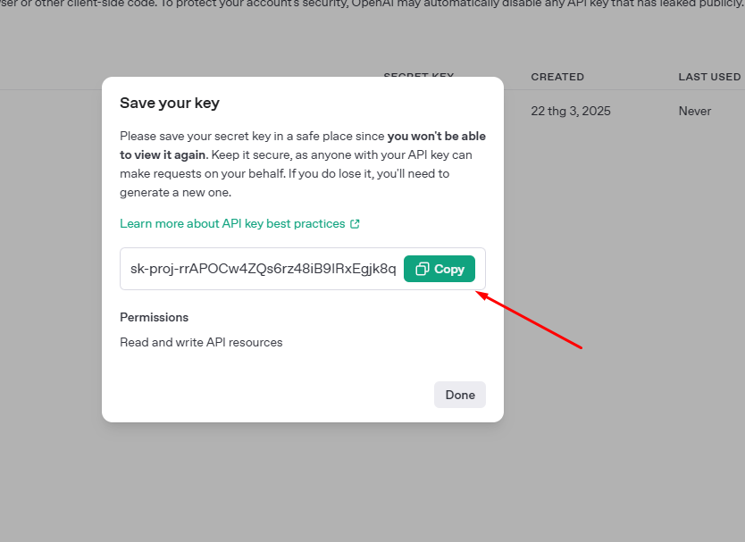
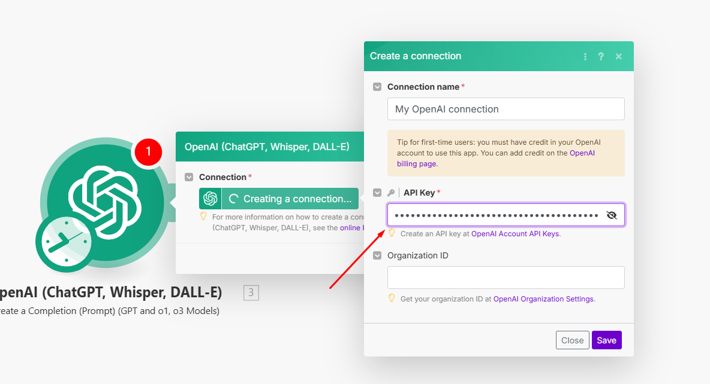

Bạn có thể kết nối **Make.com** với **ChatGPT (OpenAI API)** theo các bước sau:

---

### **Bước 1: Đăng nhập vào Make.com**  
1. Truy cập [Make.com](https://www.make.com/) và **đăng nhập** hoặc **tạo tài khoản** nếu chưa có.  
2. Nhấn **"Create a new scenario"** để bắt đầu tạo luồng tự động hóa.  

---

### **Bước 2: Thêm OpenAI (ChatGPT) vào Scenario**  
1. Nhấn vào dấu **"+"** để thêm một module mới.  
2. Tìm và chọn **OpenAI**.  

3. Chọn hành động mong muốn, ví dụ:  
   - **Create a Completion (Prompt)** → Gửi câu hỏi/tin nhắn đến ChatGPT.  
   - **Generate Image** → Tạo hình ảnh bằng DALL·E.  

---

### **Bước 3: Kết nối OpenAI API với Make**  
1. Nhấn **"Create a connection"** (Nếu bạn đã có ít nhất 1 connection rồi thì chọn **"Add"**) để tạo kết nối mới.  

2. Truy cập [https://platform.openai.com/account/api-keys](https://platform.openai.com/account/api-keys) để tạo **API Key**.

3. Sao chép API Key và dán vào Make.com để kết nối.  

---

### **Bước 4: Cấu hình & Kiểm tra**  
1. Nhập nội dung yêu cầu (prompt) cho ChatGPT.  
2. Nhấn **"Run once"** để kiểm tra kết nối.  
3. Nếu hoạt động đúng, nhấn **"Save"** và bật **"ON"** để tự động hóa.  