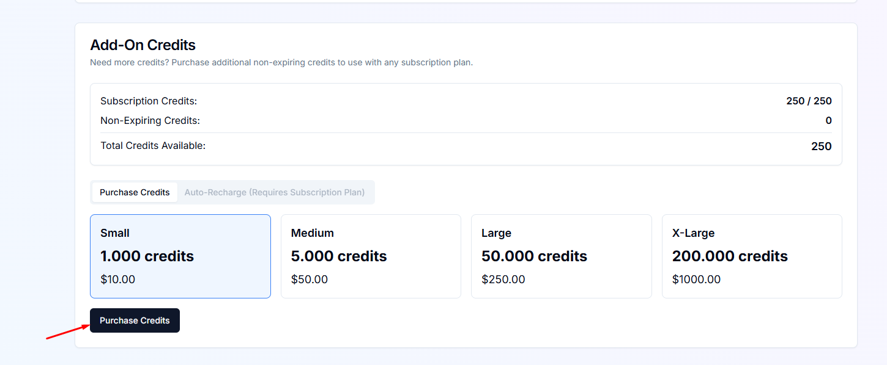

​Để mua và sử dụng API của Dumpling AI, bạn có thể thực hiện theo các bước sau:

### **Bước 1: Đăng ký tài khoản Dumpling AI**
- Truy cập trang web của Dumpling AI tại [https://www.dumplingai.com/](https://www.dumplingai.com/).
- Nhấp vào nút **"Get started"** hoặc **"Sign up"**.
- Bạn có thể đăng ký bằng tài khoản Google hoặc sử dụng email để tạo tài khoản mới.

### **Bước 2: Truy cập và tạo API Key**
- Sau khi đăng nhập, truy cập trang quản lý tài khoản hoặc cài đặt của bạn.
- Tìm mục **"Manage plan"**.
- 
- Tìm phần **"Add-On Credits"** và chọn số credits muốn mua và nhấp vào **"Purchase Credits"**
- 
- Nhập thông tin thẻ thanh toán (Visa/Mastercard) và tiến hành thanh toán.
- 