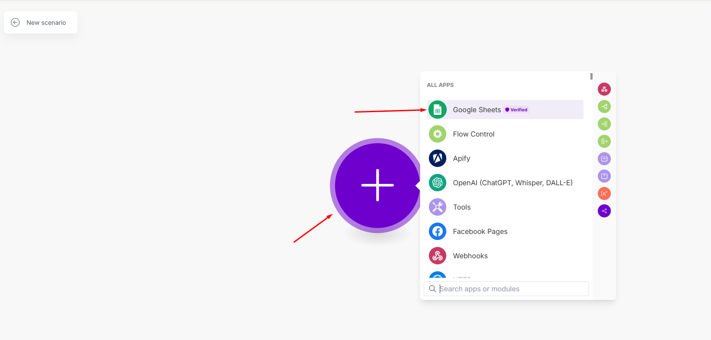
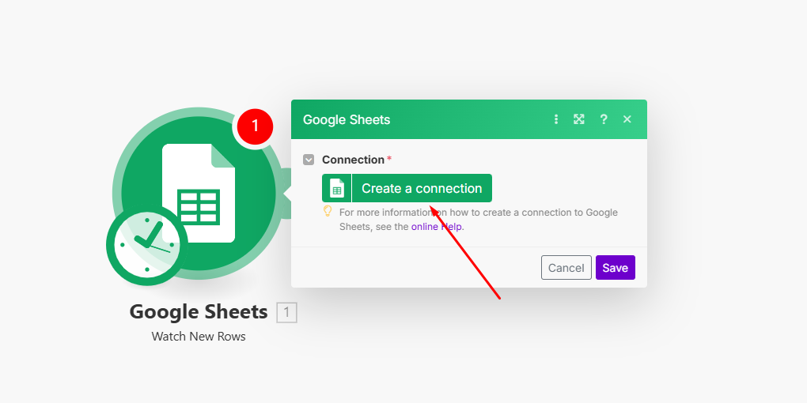
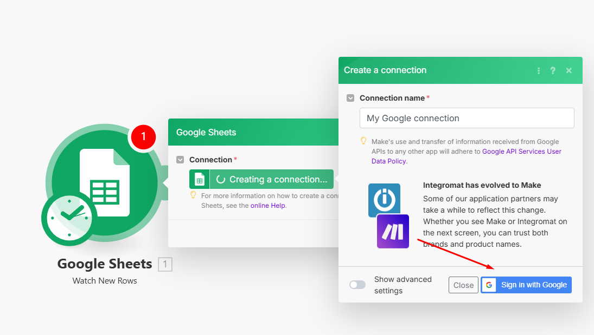
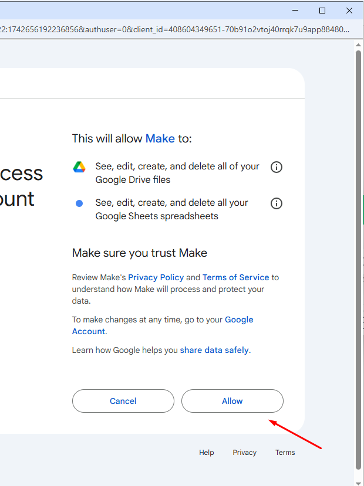
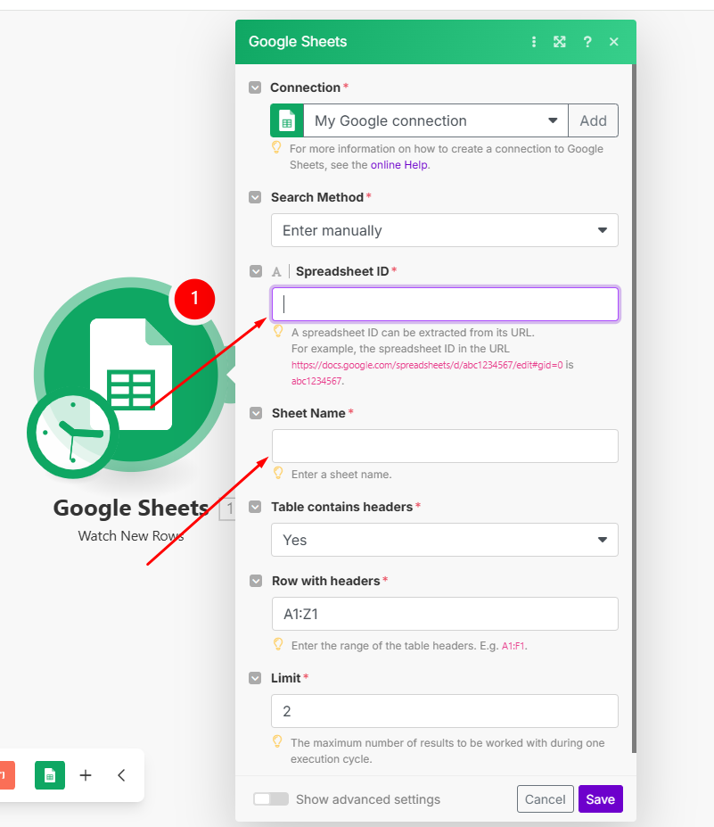

Bạn có thể kết nối **Make.com** với **Google Sheets** theo các bước sau:

---

### **Bước 1: Đăng nhập vào Make.com**
1. Truy cập [Make.com](https://www.make.com/) và đăng nhập hoặc tạo tài khoản mới.
2. Nhấp vào **"Create a new scenario"** để bắt đầu tạo luồng tự động hóa.

---

### **Bước 2: Thêm Google Sheets vào Scenario**
1. Nhấn vào dấu **"+"** ở giữa màn hình để thêm một module mới.
2. Tìm và chọn **Google Sheets**.

3. Chọn hành động mong muốn, chẳng hạn:
   - **Watch New Rows** → Theo dõi thay đổi trên Google Sheets.
   - **Add a Row** → Thêm một dòng vào Google Sheets.
   - **Update a Row** → Cập nhật dữ liệu trên Google Sheets.

---

### **Bước 3: Kết nối Google Sheets với Make**
1. Nhấn **"Create a connection"** (Nếu bạn đã có ít nhất 1 connection rồi thì chọn **"Add"**) để tạo kết nối.

2. Đăng nhập vào tài khoản **Google** và cấp quyền truy cập cho Make.com.

3. Chọn **Google Sheet** bạn muốn sử dụng.
4. Chọn **Worksheet** (trang tính) và cấu hình thông số phù hợp.

---

### **Bước 4: Cấu hình & Kiểm tra**
1. Thiết lập các trường dữ liệu bạn muốn Make.com xử lý.
2. Nhấn **"Run once"** để kiểm tra kết nối.
3. Nếu dữ liệu được gửi hoặc nhận đúng như mong muốn, nhấn **"Save"** và bật **"ON"** cho Scenario.