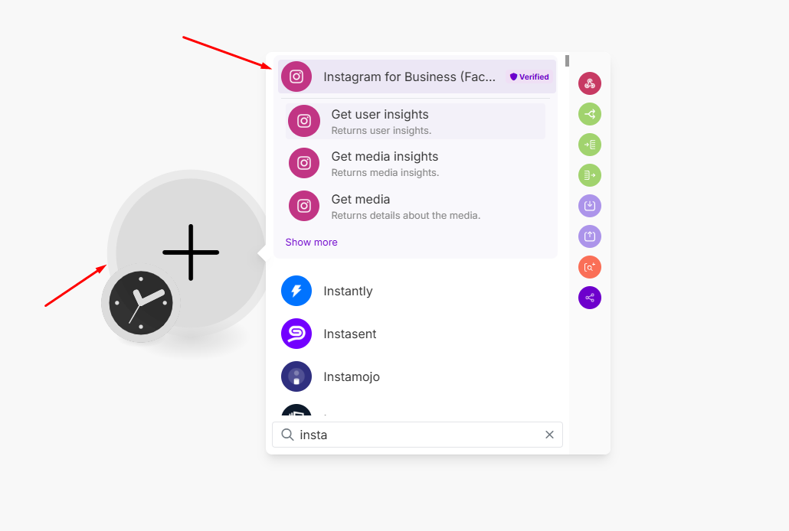
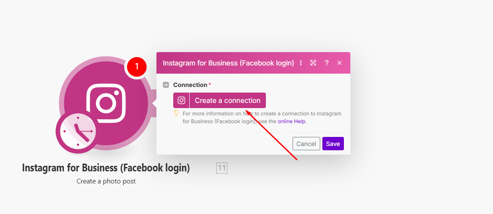
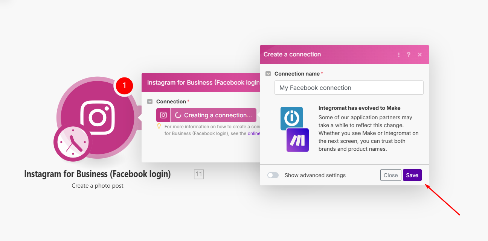
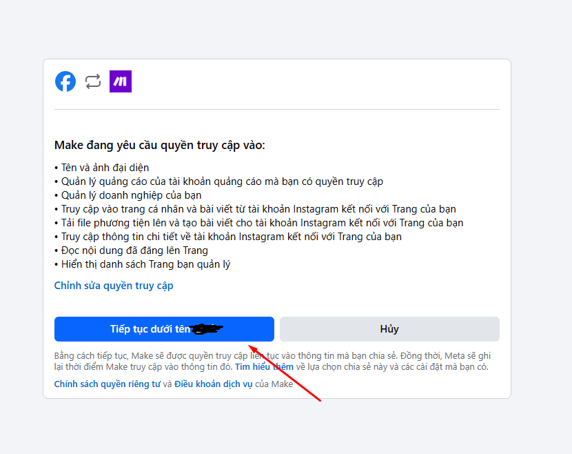
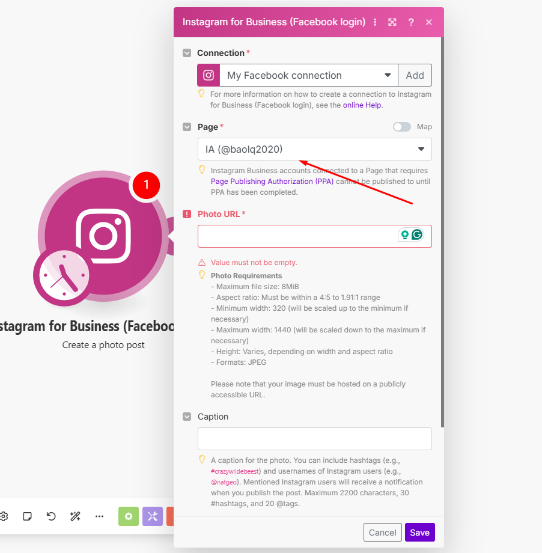

Bạn có thể kết nối **Make.com** với **Instagram** để tự động hóa các tác vụ như đăng bài, theo dõi bình luận hoặc lấy dữ liệu bài viết. Dưới đây là hướng dẫn chi tiết:  

---

### **Bước 1: Đăng nhập vào Make.com**  
1. Truy cập [Make.com](https://www.make.com/) và **đăng nhập** hoặc **tạo tài khoản** nếu chưa có.  
2. Nhấn **"Create a new scenario"** để bắt đầu tạo luồng tự động hóa.  

---

### **Bước 2: Thêm Instagram vào Scenario**  
1. Nhấn vào dấu **"+"** để thêm một module mới.  
2. Tìm và chọn **Instagram for Business**.  

3. Chọn hành động mong muốn, ví dụ:  
   - **Create a Post** → Đăng bài viết lên Instagram.  
   - **Watch Media** → Theo dõi bài viết mới trên tài khoản.  

---

### **Bước 3: Kết nối Instagram với Make**  
1. Nhấn **"Create a connection"** (Nếu bạn đã có ít nhất 1 connection rồi thì chọn **"Add"**) để tạo kết nối mới.  

2. Đăng nhập vào tài khoản **Facebook** (Instagram được quản lý qua Meta Business Suite).  
3. Cấp quyền truy cập vào tài khoản Instagram Business mà bạn muốn kết nối.  

4. Chọn tài khoản **Instagram Business** bạn muốn sử dụng.  

📌 **Lưu ý:**  
- Tài khoản Instagram phải được **liên kết với một Facebook Page**.  

---

### **Bước 4: Cấu hình & Kiểm tra**  
1. Nhập nội dung bài viết hoặc thiết lập các điều kiện theo dõi dữ liệu.  
2. Nhấn **"Run once"** để kiểm tra kết nối.  
3. Nếu hoạt động đúng, nhấn **"Save"** và bật **"ON"** để tự động hóa.  