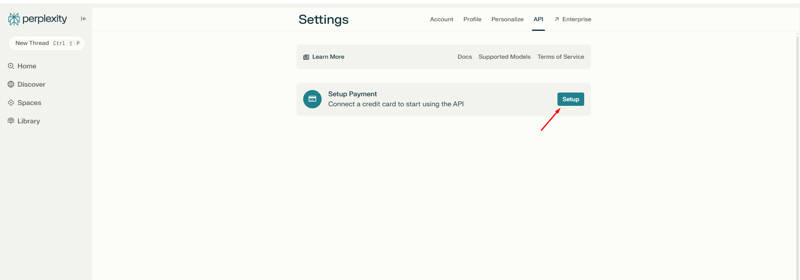
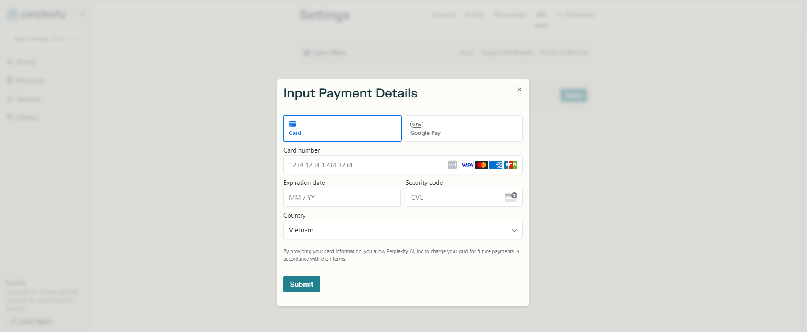
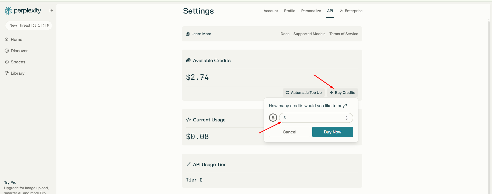

Để mua và sử dụng API của Perplexity, bạn có thể thực hiện theo các bước sau:

### **Bước 1: Đăng ký hoặc đăng nhập tài khoản Perplexity**
- Truy cập trang web Perplexity tại [https://www.perplexity.ai/](https://www.perplexity.ai/).
- Nếu chưa có tài khoản, bạn cần đăng ký bằng cách cung cấp thông tin cần thiết. Nếu đã có tài khoản, hãy đăng nhập.

### **Bước 2: Truy cập cài đặt API**
- Sau khi đăng nhập, nhấp vào biểu tượng **"Settings"** (Cài đặt) ở góc dưới bên trái.
- Trong menu cài đặt, chọn tab **"API"**.

### **Bước 3: Thêm phương thức thanh toán**
- Để sử dụng API, bạn cần thêm thông tin thanh toán.
- Trong tab **"API"**, bạn sẽ thấy tùy chọn để thêm phương thức thanh toán.
- 
- Nhập thông tin thẻ tín dụng hoặc các phương thức thanh toán khác theo hướng dẫn.
- 
- Sau đó chọn **"Buy Credits"** và nhập số credit vào (It nhất là 3$)
- 
- Chọn **"Buy Now"** là bạn đã mua Perplexity API Credit thành công.