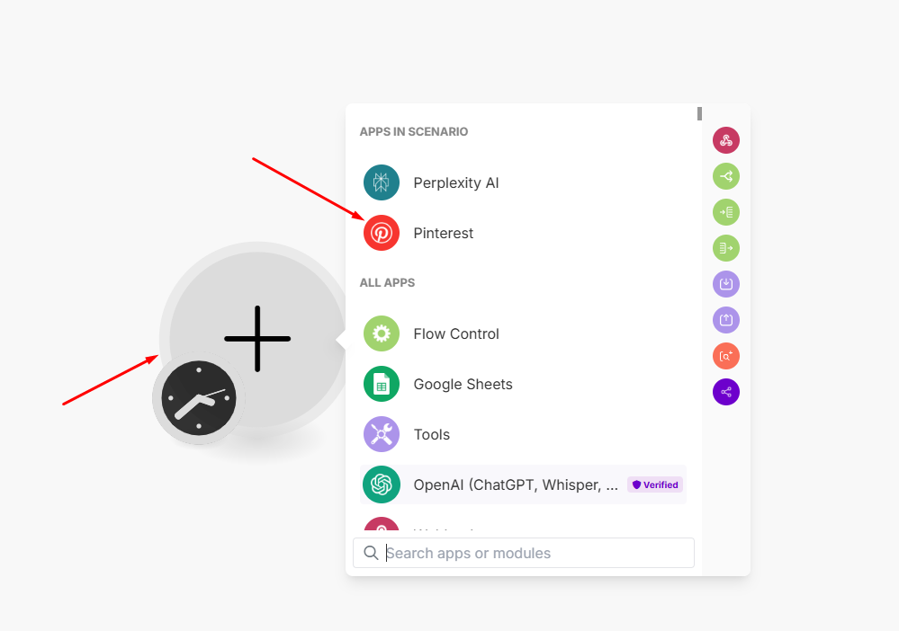
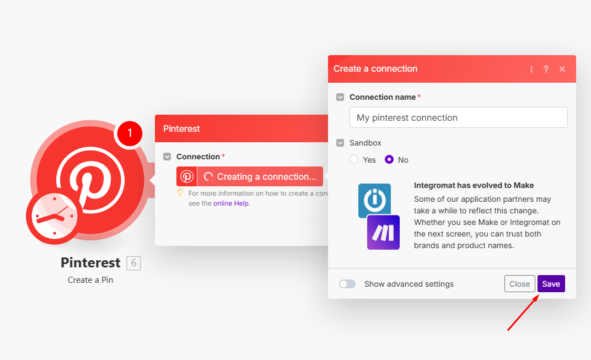

Bạn có thể kết nối **Make.com** với **Pinterest** để tự động hóa các tác vụ như đăng ảnh, lấy dữ liệu bài viết hoặc theo dõi tương tác. Dưới đây là hướng dẫn chi tiết:  

---

### **Bước 1: Đăng nhập vào Make.com**  
1. Truy cập [Make.com](https://www.make.com/) và **đăng nhập** hoặc **tạo tài khoản** nếu chưa có.  
2. Nhấn **"Create a new scenario"** để bắt đầu tạo luồng tự động hóa.  

---

### **Bước 2: Thêm Pinterest vào Scenario**  
1. Nhấn vào dấu **"+"** để thêm một module mới.  
2. Tìm và chọn **Pinterest**.  

3. Chọn hành động mong muốn, ví dụ:  
   - **Create a Pin** → Đăng ảnh mới lên Pinterest.  
   - **Get Pins from a Board** → Lấy danh sách bài đăng từ một bảng.  
   - **Search Pins** → Tìm kiếm nội dung trên Pinterest.  

---

### **Bước 3: Kết nối Pinterest với Make**  
1. Nhấn **"Create a connection"** (Nếu bạn đã có ít nhất 1 connection rồi thì chọn **"Add"**) để tạo kết nối mới.  

2. Đăng nhập vào tài khoản **Pinterest** của bạn.  
3. Cấp quyền truy cập cho Make.com để có thể đăng bài hoặc lấy dữ liệu.  

---

### **Bước 4: Cấu hình & Kiểm tra**  
1. Nhập nội dung bài đăng, ảnh hoặc các thông tin cần thiết.  
2. Nhấn **"Run once"** để kiểm tra kết nối.  
3. Nếu hoạt động đúng, nhấn **"Save"** và bật **"ON"** để tự động hóa.  