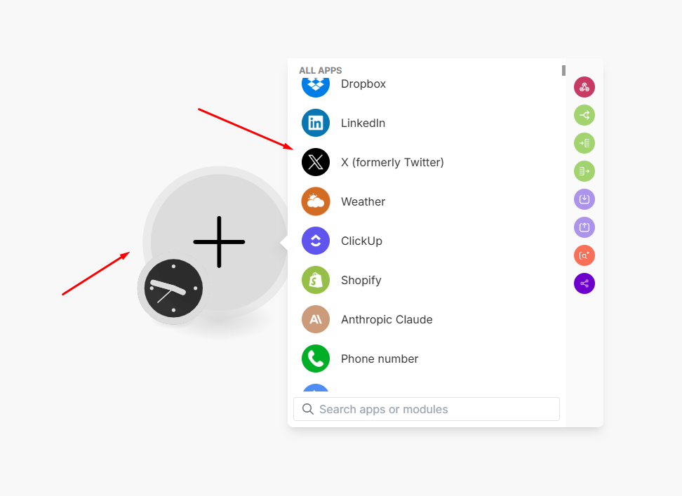
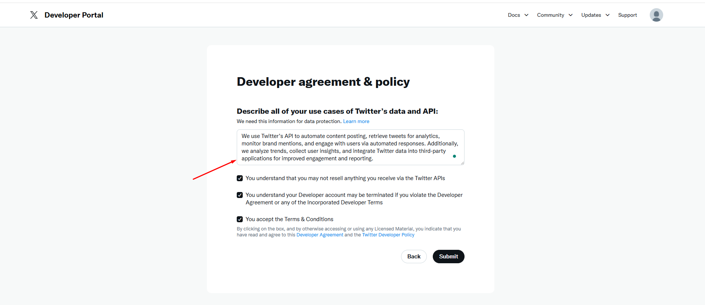
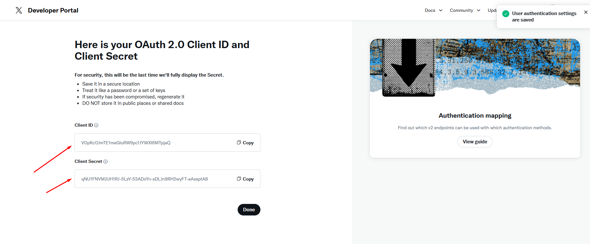
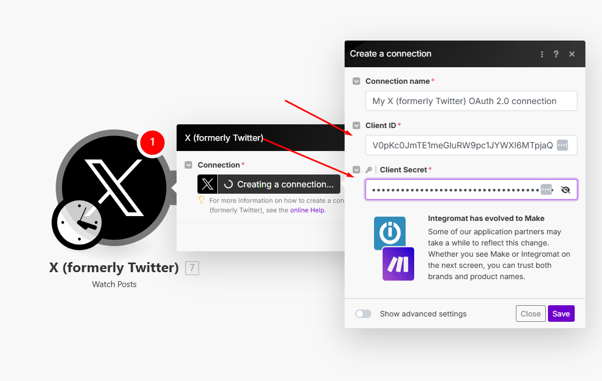
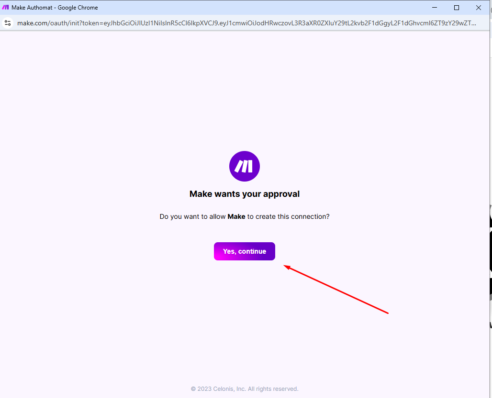
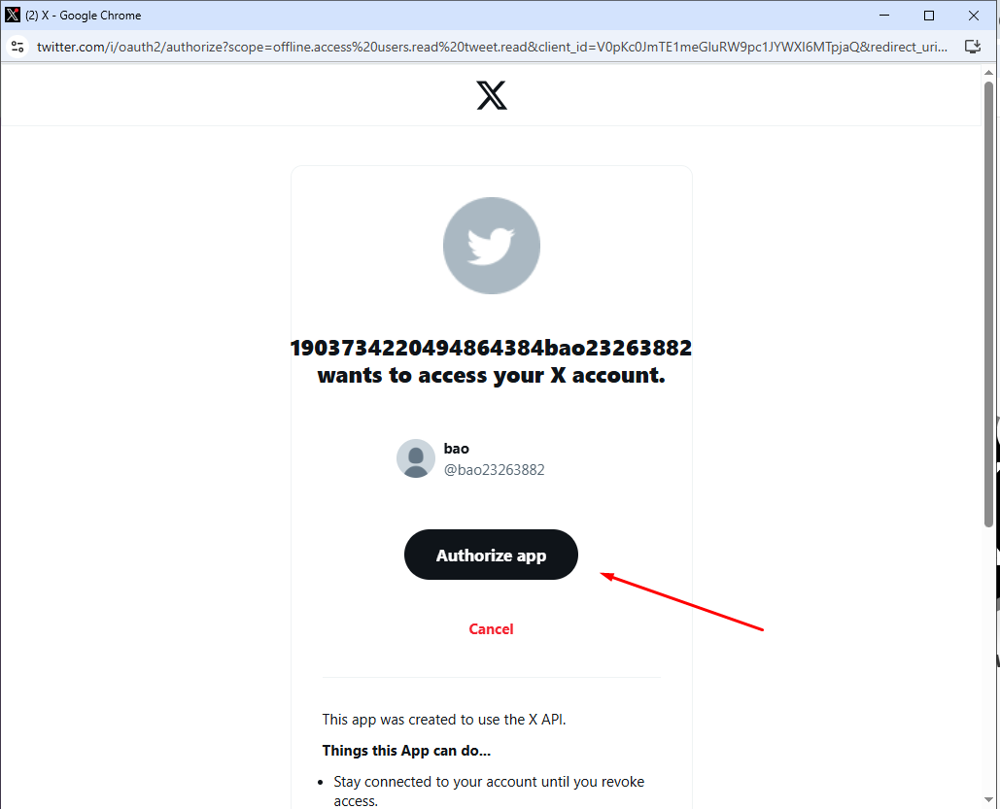

Bạn có thể kết nối **Make.com** với **X (Twitter)** để tự động hóa các tác vụ như đăng tweet, theo dõi tương tác hoặc lấy dữ liệu bài viết. Dưới đây là hướng dẫn chi tiết:  

---

### **Bước 1: Đăng nhập vào Make.com**  
1. Truy cập [Make.com](https://www.make.com/) và **đăng nhập** hoặc **tạo tài khoản** nếu chưa có.  
2. Nhấn **"Create a new scenario"** để bắt đầu tạo luồng tự động hóa.  

---

### **Bước 2: Thêm X (Twitter) vào Scenario**  
1. Nhấn vào dấu **"+"** để thêm một module mới.  
2. Tìm và chọn **X (Twitter)**.  

3. Chọn hành động mong muốn, ví dụ:  
   - **Create a Tweet** → Đăng tweet mới.  
   - **Search Tweets** → Tìm kiếm tweet theo từ khóa.  
   - **Watch Mentions** → Theo dõi các tweet đề cập đến tài khoản của bạn.  
   - **Get User Tweets** → Lấy danh sách tweet từ một tài khoản cụ thể.  

---

### **Bước 3: Tạo ứng dụng tùy chỉnh trên X (trước đây là Twitter)

1. Đăng nhập vào trang web dành cho nhà phát triển của X: [X Developer](https://developer.twitter.com/).  
2. Nhấp vào **Developer Portal** ở góc trên bên phải.  
3. Nhấp vào **Sign up for a Free Account** để đăng ký tài khoản miễn phí.  
4. Mô tả các trường hợp sử dụng của bạn trong **Make**, chọn tất cả các hộp kiểm và nhấp vào **Submit**.  

5. X sẽ tự động tạo một **Dự án (Project)** và một **Ứng dụng (App)** trong dự án. Nếu bạn đã có ứng dụng, hãy tham khảo phần **Thêm ứng dụng hiện có vào dự án**.  
6. Chọn ứng dụng của bạn và nhấp vào **Set up** trong phần **User Authentication Settings**.  
7. Chọn các tùy chọn sau:  

   - **App Permissions**: Chọn **Read, Write, and Direct Messages**.  
   - **Type of App**: Chọn **Web App and Automated App or Bot**.  
   - **App Info**: Nhập thông tin sau:  
     - **Callback URI/Redirect URL**:  
       ```
       https://www.integromat.com/oauth/cb/twitter2  
       https://www.integromat.com/oauth/cb/twitter  
       ```
     - **Website URL**:  
       ```
       https://www.integromat.com/oauth/cb/twitter  
       ```
8. Nhấp vào **Save** và xác nhận bằng cách nhấp vào **Yes**.  
9. Sao chép **Client ID** và **Client Secret**, lưu trữ chúng ở nơi an toàn.  


---

### **Bước 4: Kết nối X (Twitter) với Make**  
1. Nhấn **"Create a connection"** (Nếu bạn đã có ít nhất 1 connection rồi thì chọn **"Add"**) để tạo kết nối mới.  
2. Đăng nhập vào tài khoản **X (Twitter)** của bạn.  
3. Nhập **Client ID** và **Client Secret**.  

4. Cấp quyền truy cập cho Make.com để có thể đăng tweet hoặc lấy dữ liệu.  



---

### **Bước 5: Cấu hình & Kiểm tra**  
1. Nhập nội dung tweet, hình ảnh hoặc các thông tin cần thiết.  
2. Nhấn **"Run once"** để kiểm tra kết nối.  
3. Nếu hoạt động đúng, nhấn **"Save"** và bật **"ON"** để tự động hóa.  