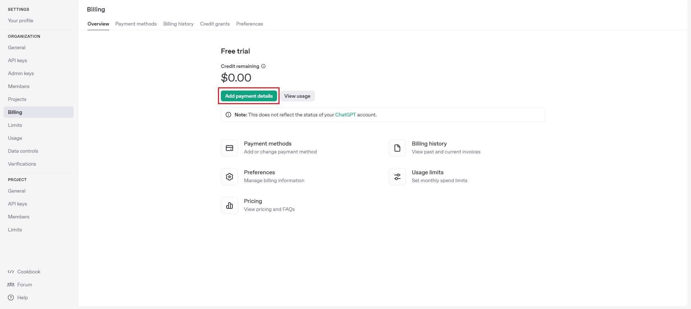
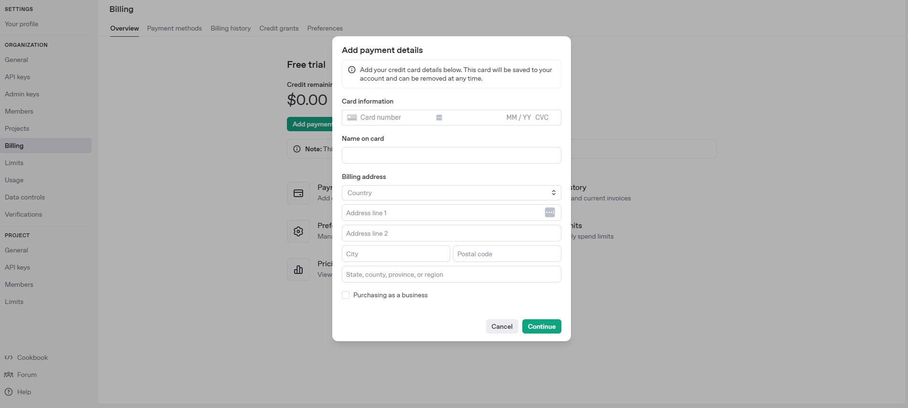
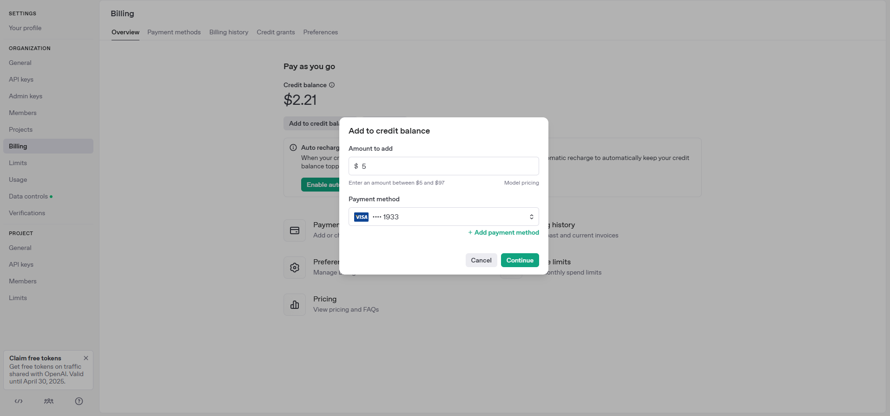

Để mua OpenAI API Key, bạn có thể làm theo các bước sau:

### **Bước 1: Truy cập trang OpenAI**
- Mở trình duyệt và truy cập vào trang OpenAI: [https://platform.openai.com/](https://platform.openai.com/)

### **Bước 2: Đăng nhập hoặc đăng ký tài khoản**
- Nếu bạn đã có tài khoản, nhấn **"Log in"** để đăng nhập.  
- Nếu chưa có tài khoản, nhấn **"Sign up"** để tạo tài khoản mới bằng email, tài khoản Google hoặc Microsoft.

### **Bước 3: Nạp tiền vào tài khoản**
- Vào **Billing** (https://platform.openai.com/account/billing)  
- Chọn **"Add payment details"** để thêm thẻ thanh toán (Visa/Mastercard).  
- 
- Nhập thông tin thẻ thanh toán (Visa/Mastercard)
- 
- Sau đó chọn **"Add to credit balance"** và nhập số credit vào (It nhất là 5$) và chọn Payment Method mới vừa nhập vào ở bước trên.
- 
- Chọn **"Continue"** là bạn đã mua Open AI API Credit thành công.