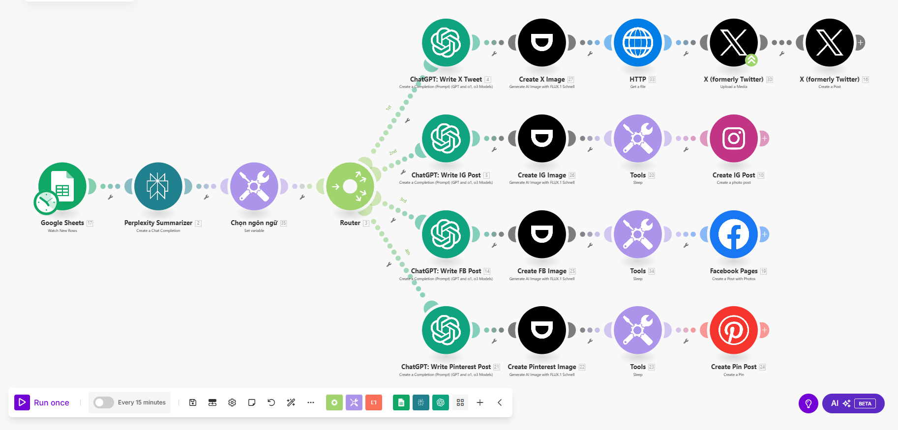

# Hướng Dẫn Sử Dụng Make.com

## 1. Giới Thiệu
Make.com là một nền tảng tự động hóa giúp kết nối các ứng dụng và dịch vụ khác nhau để thực hiện các quy trình tự động. Dự án **Link2Post** sẽ tự động lấy nội dung từ Google Sheets, tóm tắt bài viết, tạo bài đăng trên X (Twitter), Pinterest , Instagram và Facebook, đồng thời tạo hình ảnh minh họa phù hợp.
- 

## 2. Chuẩn Bị
### a. Tài Khoản
- Đăng ký hoặc đăng nhập vào [Make.com](https://www.make.com/).
- Đảm bảo bạn có quyền truy cập vào các ứng dụng cần kết nối: Google Sheets, Perplexity AI, OpenAI, Dumpling AI, Twitter, Instagram, Facebook, Pinterest.
- Mua AI API credits: [Perplexity AI](../../mua-api-key/perplexity.md), [OpenAI (GPT-4o)](../../mua-api-key/chatgpt.md), [Dumpling AI](../../mua-api-key/dumplingai.md).

### b. Kịch Bản
- [Tải kịch bản file](make-scenarios.json)
- Import Kịch Bản file vào make.com

### c. Kết Nối
- Trong Make.com, vào mục **Connections**.
- Thêm các kết nối cần thiết:
  - **[Google Sheets](../../ket-noi/google-sheet.md)**: Kết nối với bảng tính chứa dữ liệu bài viết.
  - **[Perplexity AI](../../ket-noi/perplexity.md)**: Dùng để tóm tắt bài viết.
  - **[OpenAI (GPT-4o)](../../ket-noi/chatgpt.md)**: Viết nội dung bài đăng cho mạng xã hội.
  - **[Dumpling AI](../../ket-noi/dumplingai.md)**: Tạo hình ảnh minh họa.
  - **[Twitter](../../ket-noi/x.md), [Instagram](../../ket-noi/instagram.md), [Facebook](../../ket-noi/facebook-page.md)**, [Pinterest](../../ket-noi/pinterest.md)**: Đăng nội dung lên các nền tảng này.

## 3. Kịch Bản
Dưới đây là luồng hoạt động của kịch bản **Link2Post**:
1. **Google Sheets - Watch Rows**: Theo dõi bảng tính và lấy nội dung bài viết.
2. **Perplexity AI - Summarize**: Tóm tắt bài viết để phù hợp với mạng xã hội.
3. **Set Variable**: Xác định ngôn ngữ bài đăng (Tiếng Việt).
4. **Router**: Chia luồng thành ba hướng:
   - **Twitter**: Viết tweet hấp dẫn bằng GPT-4o → Tạo ảnh minh họa → Đăng tweet kèm ảnh.
   - **Instagram**: Viết bài đăng Instagram bằng GPT-4o → Tạo ảnh → Đăng bài kèm ảnh.
   - **Facebook**: Viết bài Facebook bằng GPT-4o → Tạo ảnh → Đăng bài kèm ảnh.
   - **Pinterest**: Viết bài Pinterest bằng GPT-4o → Tạo ảnh → Đăng bài kèm ảnh.

## 4. Chạy Và Kiểm Tra
- Nhấn **Run once** để kiểm tra kịch bản.
- Theo dõi các bước thực thi, kiểm tra dữ liệu đầu ra từ từng mô-đun.
- Kiểm tra nhật ký (Logs) để xác định và khắc phục lỗi nếu có.
- Điều chỉnh mô-đun nếu cần thiết để đảm bảo hoạt động chính xác.

## 5. Lưu Lại Kịch Bản Với Những Kết Nối Đã Thành Công
- Khi kịch bản đã hoạt động đúng, nhấn **Save** để lưu lại.
- Đặt tên và mô tả kịch bản để dễ dàng quản lý.
- Kích hoạt kịch bản bằng cách đặt lịch chạy tự động (Scheduled) nếu cần.
- Theo dõi và duy trì kịch bản để đảm bảo hoạt động liên tục.

Bằng cách làm theo các bước trên, bạn có thể tự động hóa quy trình đăng bài trên mạng xã hội một cách hiệu quả với Make.com.